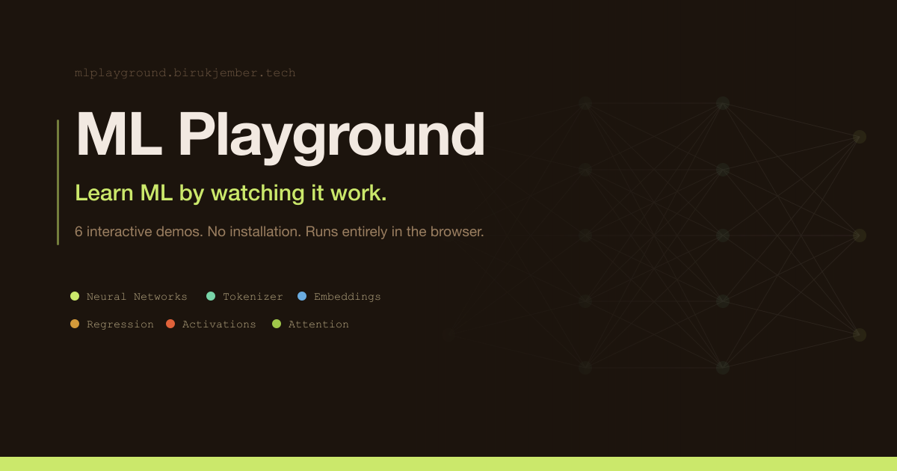
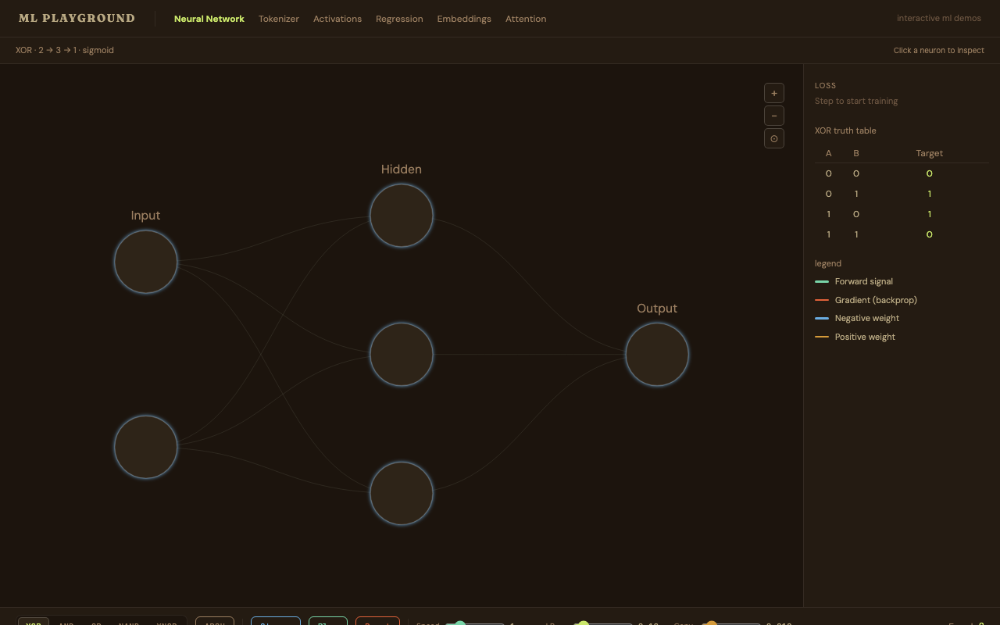
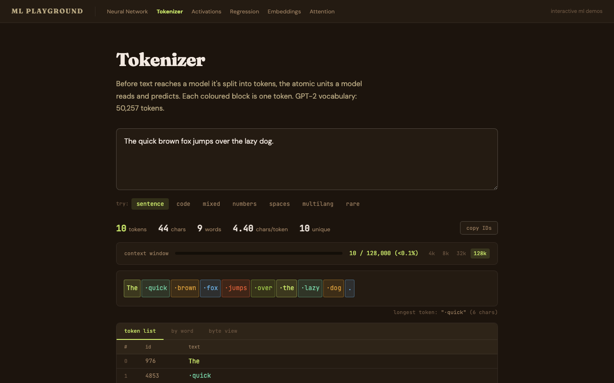
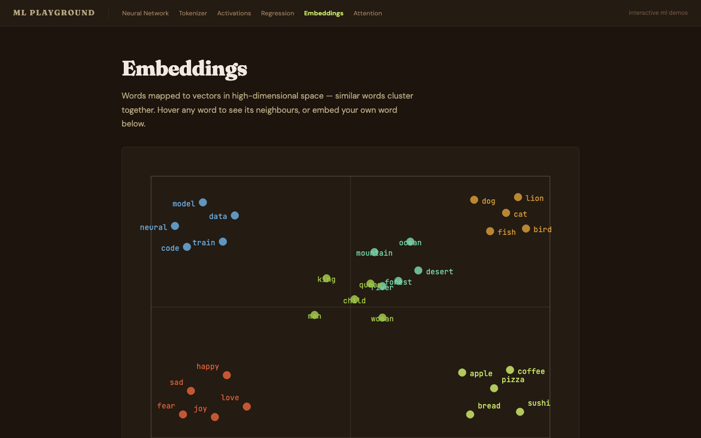
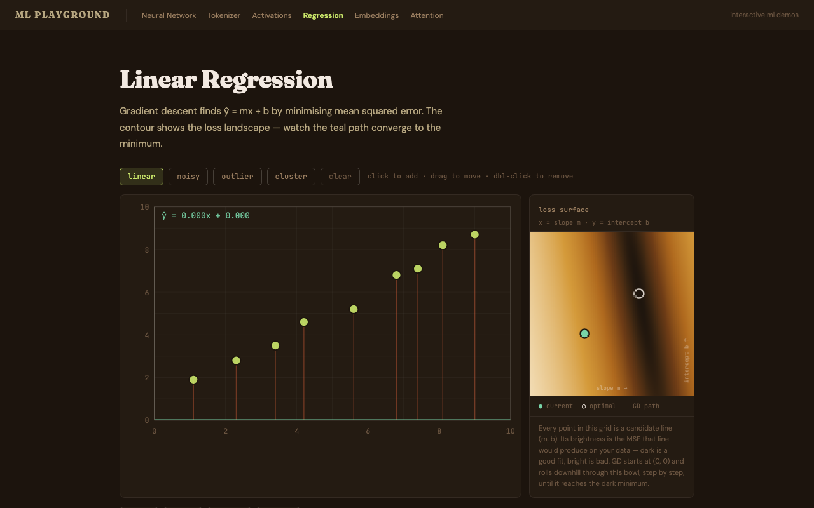
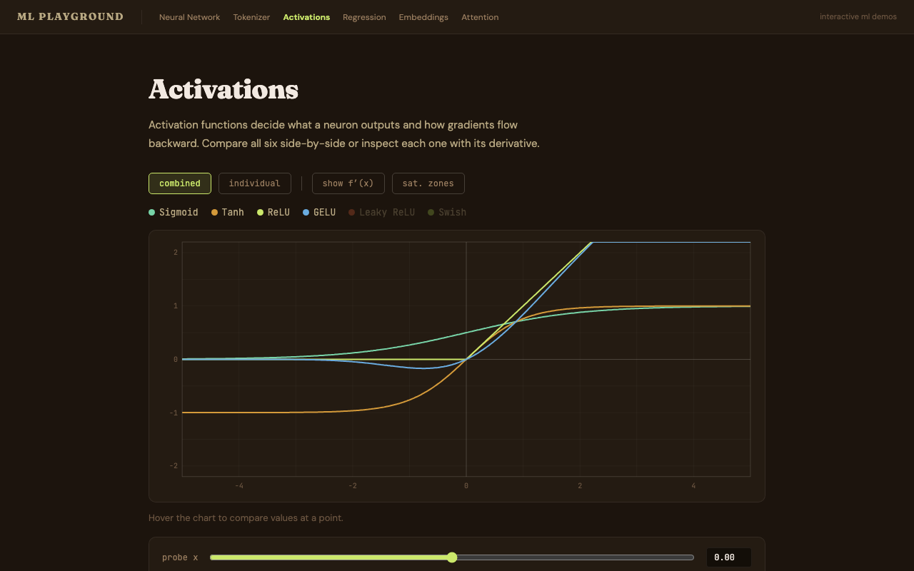
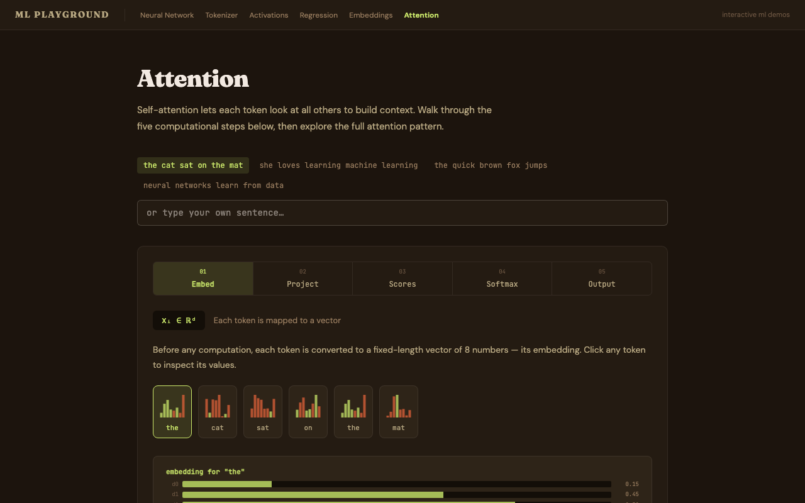

# ML Playground

**Interactive machine learning demos that run entirely in the browser — no installation, no account.**

[](https://mlplayground.birukjember.tech)
[](https://vercel.com/new/clone?repository-url=https://github.com/Biruk-gebru/nn-sim)
[](https://react.dev)
[](https://www.typescriptlang.org)
[](https://vite.dev)

Each module is a live, interactive demo. Adjust parameters and see what actually happens. No slides, no passive reading.

---

## Modules

### Neural Network


Watch a 2→3→1 network train on XOR, AND, or OR in real time. Forward pass and backpropagation animate layer by layer — data pulses travel along edges during the forward pass, gradient arrows flow backward during backprop. Click any neuron to open an inspector showing its weighted inputs, pre-activation sum, activation output, and epoch history sparkline.

---

### Tokenizer


Type any text and watch GPT-2's byte-pair encoding (BPE) tokenizer split it into tokens in real time. Each token is color-coded. See the raw token IDs, UTF-8 byte values, and how emoji and non-ASCII characters become multi-byte sequences. Useful for building intuition about context length and vocabulary.

---

### Embeddings


Enter words and see them projected into 2D space using a real `all-MiniLM-L6-v2` sentence embedding model running via WebAssembly in your browser. Explore which words cluster together and why. The 22 MB model downloads once and is cached — subsequent visits are instant.

---

### Linear Regression


Drag data points onto a canvas and watch gradient descent fit a line in real time. Control the learning rate and see how it affects convergence speed and stability. Add noise, create non-linear patterns, and observe where a linear model breaks down.

---

### Activations


Plot sigmoid, ReLU, tanh, and GELU side by side on a shared canvas. Overlay their derivatives. See exactly where vanishing gradients occur on each curve and why ReLU avoids them in the positive range. Toggle functions on and off to isolate comparisons.

---

### Attention


Enter a sentence and see a self-attention heatmap computed token by token. Inspect the raw query, key, and value vectors for any token and see how attention scores determine which tokens attend to which. Understand why "bank" attends differently in "river bank" versus "bank account."

---

## Getting started

```bash
git clone https://github.com/Biruk-gebru/nn-sim.git
cd nn-sim
npm install
npm run dev
```

Open [http://localhost:5173](http://localhost:5173).

```bash
npm run build    # production build → dist/
npm run preview  # serve the production build locally
```

No environment variables needed. Everything runs in the browser.

---

## Deployment

### One-click (Vercel)

[](https://vercel.com/new/clone?repository-url=https://github.com/Biruk-gebru/nn-sim)

Vercel detects Vite automatically. No additional configuration required.

### Manual (any static host)

```bash
npm run build
# upload the dist/ directory to Netlify, GitHub Pages, S3, etc.
```

The app is a plain SPA. The only requirement is that the host serves `index.html` for all routes. On Vercel this is handled automatically by `vercel.json`:

```json
{ "rewrites": [{ "source": "/(.*)", "destination": "/index.html" }] }
```

Configure the equivalent fallback redirect on other platforms.

---

## Stack

| | |
|---|---|
| Framework | React 19 + Vite 8 + TypeScript |
| Routing | TanStack Router |
| State | Zustand |
| Visualization | SVG (no canvas) |
| Animation | Framer Motion |
| ML inference | HuggingFace Transformers.js (ONNX / WebAssembly) |
| Tokenizer | gpt-tokenizer (GPT-2 BPE, in-browser) |
| Styling | Tailwind CSS v4 + CSS custom properties |

The neural network engine is ~150 lines of plain TypeScript with no ML library — every intermediate value is explicitly captured so the UI can display it.

---

## License

MIT
